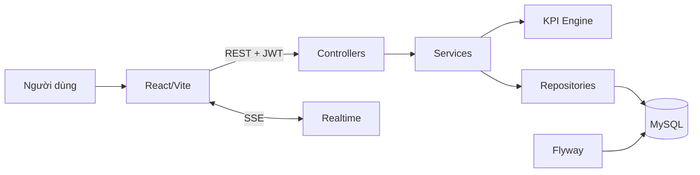

<!-- generated-by: gsd-doc-writer -->
# Kiến trúc hệ thống

GPG Union Portal là modular monolith client–server: React cung cấp UI; Spring Boot cung cấp REST API, bảo mật và nghiệp vụ; MySQL lưu dữ liệu, Flyway quản lý schema.

## Luồng request

1. Người dùng đăng nhập qua `POST /api/auth/login`.
2. Frontend gửi Bearer JWT; Spring Security xác thực token, vai trò và phiên.
3. Controller chuẩn hóa request; service áp dụng nghiệp vụ, transaction và phạm vi CĐCS.
4. Repository đọc/ghi MySQL; DTO được trả về frontend; thay đổi có thể phát qua SSE.

## Ranh giới module

| Khu vực | Trách nhiệm |
|---|---|
| `frontend/src/pages` | Màn hình nghiệp vụ |
| `frontend/src/components` | UI dùng lại |
| `backend/.../controller` | HTTP contract |
| `backend/.../service` | Nghiệp vụ và KPI |
| `backend/.../repository` | Truy cập dữ liệu |
| `backend/.../security` | JWT và rate limit |
| `backend/src/main/resources/db/migration` | Phiên bản schema |

Nguyên tắc chính: backend là nguồn KPI; phạm vi `USER` lấy từ JWT; dữ liệu thiếu không được suy đoán; file nhạy cảm luôn đi qua endpoint xác thực.
